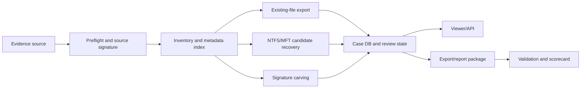

# RapidForensic Recovery Engine Architecture

Status: engineering-reviewed for implementation
Date: 2026-05-31
Authority: `docs/plans/rapidforensic-recovery-review-plan-2026-05-30.md`

## Architecture Summary

RapidForensic recovery is a staged pipeline. Each stage emits a durable manifest, hashes its outputs, preserves source provenance, and refuses to promote a result beyond the evidence that supports it.

## Source Adapters

| Adapter | Current implementation state | Release claim limit |
| --- | --- | --- |
| Folder/mounted source | Implemented | Direct scan/export of current files |
| Raw image | Implemented through extraction workflow when tools are present | Requires tool logs and output hash evidence |
| E01/Ex01 | Implemented preflight/extract/smoke with external tools | Requires valid EWF image, libewf/Sleuth Kit logs, trusted diff |
| NTFS metadata | Partial native MFT/USN parser and artifact collectors | Candidate metadata only until full known-answer/trusted diff passes |
| Unallocated bytes | Bounded carving command | Candidate recovery only until carving corpus/trusted diff passes |

## Core Data Model

| Field | Meaning |
| --- | --- |
| `source_id` | Stable id for the evidence source or derived extraction root |
| `source_hash` | Hash of source image, container, file, or row input where available |
| `source_container_type` | folder, raw, e01, zip, sqlite, ntfs-record, carved-stream |
| `filesystem_type` | NTFS, APFS, HFS, FAT, exFAT, unknown |
| `candidate_id` | Stable id derived from source id, record/offset/path, and candidate kind |
| `candidate_kind` | existing, deleted-entry, orphan-record, carved, partial-corrupt |
| `source_path` | Current or reconstructed path when known |
| `record_or_offset` | Filesystem record id, byte offset, archive entry, table row, or locator |
| `output_path` | Exported/recovered output path, if materialized |
| `hashes` | MD5/SHA1/SHA256 where policy requests them |
| `confidence` | deterministic label or numeric score from validation rules |
| `limitation` | Required limitation text for incomplete or unvalidated candidates |
| `validation_status` | pass, fail, candidate, blocked, not-applicable |
| `review_state` | unreviewed, relevant, not-relevant, needs-review, report-selected |

## Stage Contracts

| Stage | Contract |
| --- | --- |
| Preflight | Identify source type, validate header/tool availability, record source signature, never mutate source. |
| Inventory | Enumerate bounded metadata, hashes, file categories, known-good state, parser versions, and source locators. |
| Existing export | Copy only approved files inside analysis root, sanitize paths, deduplicate names, emit export manifest. |
| NTFS candidate recovery | Parse candidate records and mark deleted/nonresident/fragmented/overwritten limitations; do not claim complete recovery without diff evidence. |
| Carving | Stream chunks with overlap, detect supported signatures, validate boundaries, write candidate output and offset manifest. |
| Index/search | Persist queryable metadata with candidate kind, source/app path, extension, size, timestamps, confidence, and review state. |
| Viewer | Show result classes separately, support fast filters, and preserve source/read/export actions. |
| Report/export | Include citation, source hash, output hash, limitation, review state, and validation status. |

## Checkpoint and Resume

Long-running stages use the following policy:

1. Write temp output first, then atomically rename.
2. Write checkpoint manifests with source signature and output hashes.
3. Resume only when source signature and expected output hashes match.
4. Treat partial outputs as suspect unless a stage-specific resume contract proves completeness.
5. Surface failed stages and retry lineage in the viewer/API.

Existing implementations already expose run `--resume`, E01 stage checkpoints, E01 hash checkpoints, source-search resume tokens, and job-store retry/cancel state. Full parser-level mid-stream resume remains a release blocker for very large parser stages.

## Security Boundaries

| Boundary | Rule |
| --- | --- |
| Source files | Read-only; no in-place mutation. |
| Export paths | Resolved paths must remain inside selected root/output. |
| API | `/api` requires header token by default; Host and mutating Origin are checked. |
| XML/archives | XML rejects DTD/entity constructs; archive/source previews are bounded. |
| Database | Unsupported schema is rejected before mutation; `audit_event` is append-only. |
| Reports | No result is promoted without citation, hash, limitation, and review state. |

## Performance Design

| Concern | Design |
| --- | --- |
| Million-file metadata | SQLite/FTS and optional columnar benchmark paths; pagination and filter-first UI. |
| 10TB source | Chunked reads, bounded previews, external extraction logs, staged manifests, resume checkpoints. |
| Memory | Stream large sources; avoid loading complete image/file sets into memory. |
| UI latency | Server-side pagination, fast filters, source-read previews, and virtualized result rendering. |
| Failure recovery | Stage manifests, checkpoint hashes, job state, retry lineage, and crash reports. |

## Release Architecture Blockers

These are architecture blockers for a production release, not design unknowns:

- Full Windows E01/Ex01 recovery must be validated on Windows with real or approved lab evidence.
- Full NTFS deleted-file recovery needs known-answer deleted/fragmented/nonresident fixtures and trusted diffs.
- 10TB/1M-file survival needs completed resource telemetry.
- Legal/operator review must approve release wording and methodology.
- Signed Windows/macOS packaging must be tested with external tool discovery and Unicode path handling.
